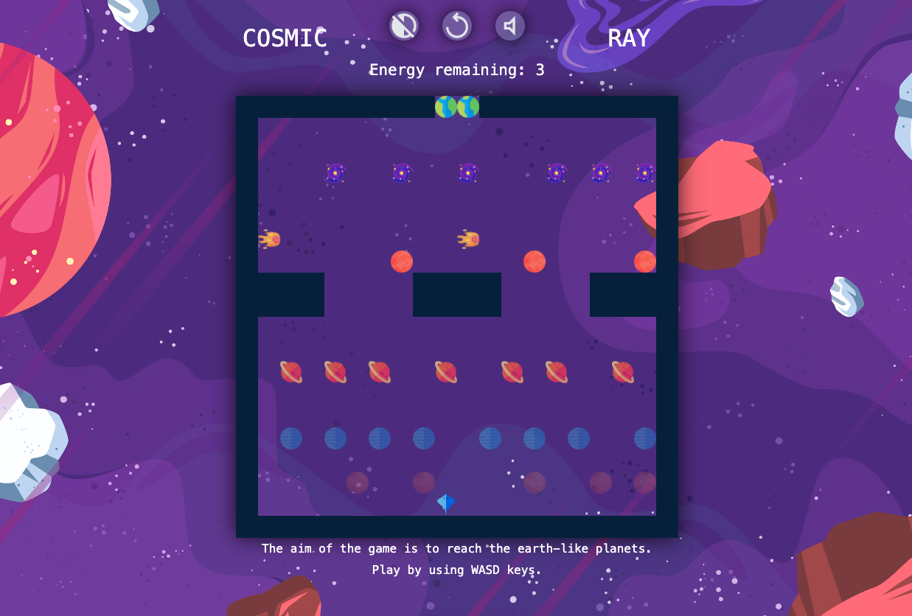
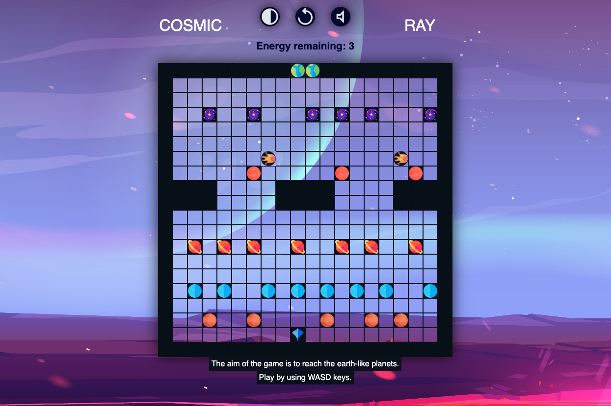

### COSMIC RAY

A simple game where you have to avoid obstacles and reach the destination at the top of the grid. The player's character, the manta ray, is controllable using the WASD keys. The game can then be reset by using the middle button at the top of the screen (the looping arrow button).

Additional features include a 'high contrast' mode and a soundtrack.

[The game can be played by clicking here](https://polynomial-b.github.io/cosmic-ray-game/)

Or copying the link here [https://polynomial-b.github.io/cosmic-ray-game/](https://polynomial-b.github.io/cosmic-ray-game/)

### Asset Sources

I have used all image sources from https://www.freepik.com/

The song used as the soundtrack is 'Diving Faces (Club Mix)' by 'Liquid Child' from 'Diving Faces'. Published by Reef Recordings (2007).

### Improvements to be made:

'Free mode' - remove collision and add toggle button.

'Less flashing mode' - less flashing, slower moving objects -- for accessibility.

