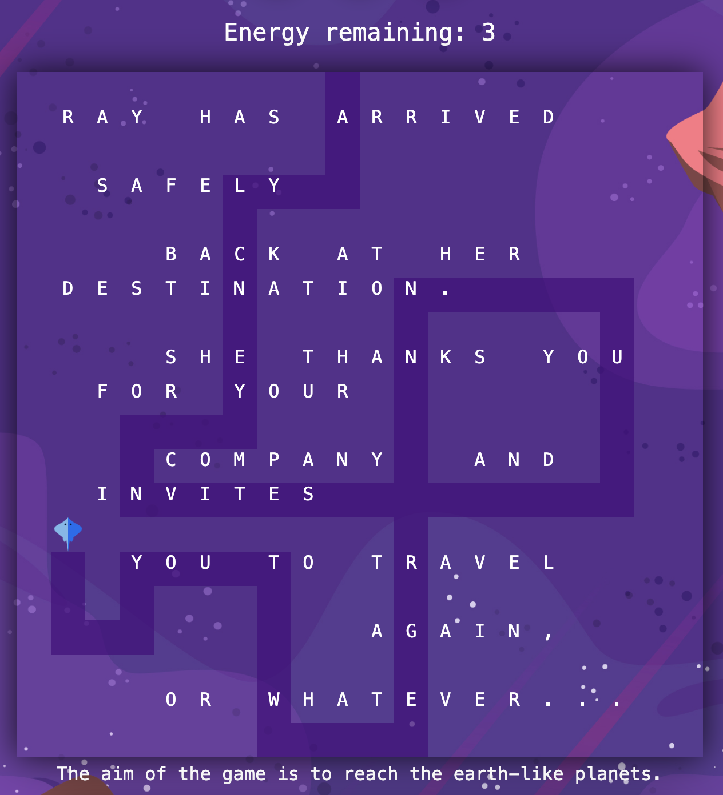
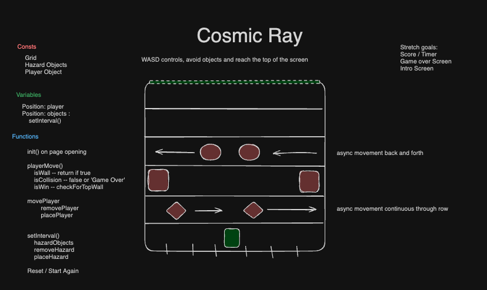
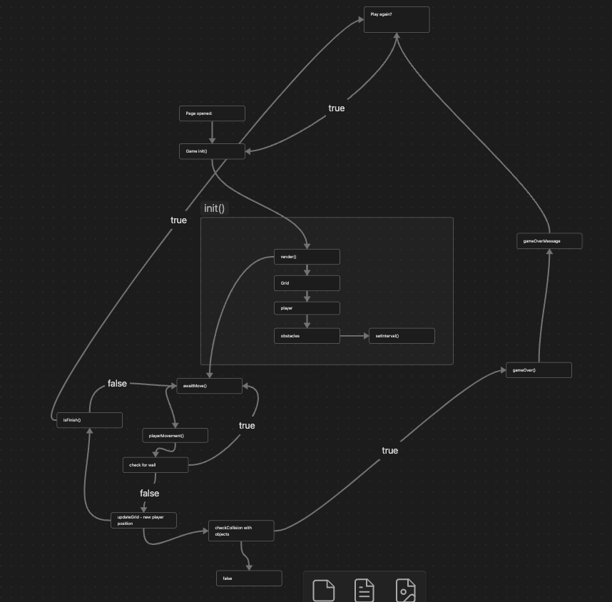

# General Assembly Project 1: Cosmic Ray

## Brief

### Project Members:

-   Matt Lamb

### Timeframe:

-   7 Days

### Goal:

Create a static Single Page App game with a win/loss scenario.

## Cosmic Ray:

### Deployed Project Link:

[Click here to visit Cosmic Ray](https://polynomial-b.github.io/cosmic-ray-game/).

Cosmic Ray is a game where you attempt to avoid obstacles and reach the earth-like twin planets using the WASD keys.

I wanted to create a game that didn't focus on violence or death, as an endgame scenario; the loss scenario for the game is described as the character resting on a hospitable planet.

## Accreditations

All images from https://www.freepik.com/

The song used as the soundtrack is 'Diving Faces (Club Mix)' by 'Liquid Child' from 'Diving Faces'. Published by Reef Recordings (2007).

The moving sound was created by me.

## Technologies and Dependencies

HTML
CSS
Javascript

## Approach, Planning & Building

I wireframed the app using Excalidraw (see 'Game Plan', below) and built a basic prototype of the game movement within a grid, using JavaScript, HTML and basic CSS.

I then created a logic flowchart using Obsidian (see 'Logic Diagram', below) to determine the game states and to give me an idea of the logic and scenarios needed.

The border check was implemented in the 'movement' stage, so upon a WASD keypress there is a check to make sure that the square that Ray is attempting to move into does not have the class of 'wall'.

The collision logic was implemented both in the movement stage, like with the border check, but was also applied to the moving obstacles, in the event of the character failing to move out of a particular square and an obstacle moving into that same square. This would then determine the 'loss' scenario of the game.

Finally, the 'win' scenario could be checked if Ray's position matched that of the earth-like twin planets. This wasn't done using classes because the grid is a set width, therefore I could simplify and use the following code:

```
function checkWin() {
  if (mantaIndex === 9 || mantaIndex === 10) {
    gameWin();
  }
}
```

## Wins, Challenges and Bugs

### Wins

I was most proud of the end game screen, including the hidden mini-game.

I wanted a nostalgic 'old-school' video game feel, which I (hopefully!) achieved through embedding the 'Game Over' win/loss scenarios into the game grid.

The most fun I had was creating the hidden feature which triggers after a win scenario is achieved or all energy is spent. For the user the win/loss text renders inside the grid and the user can continue to move Ray across the screen, 'painting' the squares. This wasn't something that I'd planned and I coded it at a whim.

### Bugs

The sound sometimes doesn't render correctly, which may be due to the game lacking any `async/await` functions.

Another oversight is that, if you lose the game, in the end game 'painting' mode you can make your way to the top of the screen, without the in-game obstacles, and you can trigger the win scenario by landing on the middle two squares at the top of the grid (where the earth-like planets would otherwise render).

### Challenge: Referencing the Grid

To overcome the challenge of counting each grid item, I added two lines of code below:

```
    // cell.setAttribute('data-index', i)
    // cell.innerText = i
```

This made it easier for me to reference which grid squares I was working with without having to count each individual grid square.

### Challenge: Setting Timeframes

Another challenge that I faced in this project was managing my time efficiently. I often spent too long time on minor details (styling, for example) where I could have instead improved the readability of the code. This experience taught me the importance of setting realistic targets within reasonable timeframes. I learned that I should timebox problems, so if something can't be resolved within a certain time and it is not required for the MVP (minimal viable product) then it should be put aside as a potential stretch goal.


## Screenshots

### Game


Additional features include a 'high contrast' mode and a soundtrack.


'Painting' in the Win Scenario



### Game Plan



### Logic Diagram



## Improvements for the future:

### Accessibility:

-   Sound cues for Game Over and obstacle interaction scenarios
-   Reduced flashing / motion mode
-   Difficulty adjustment (speed/number of obstacles)

### Design Improvements:

-   Addition of my own music to replace the current soundtrack.

### Refactoring:
Code refactoring is something that I would like to do. The moving planet functions are all separate, but should be combined into a single function to be called for each of the 6 sets of obstacles.

The following could be implemented using:

```
let planetIndex = []

function movePlanet(startPosition, endPosition, speed, direction, planetIndex){
    setInterval(() => {
    removePlanet();
    if (direction === "rightToLeft") {
      planetIndex = planetIndex.map((planet, i) => {
        if (planet <= startPosition) {
          return (planet += 17);
        } else {
          return (planet -= 1);
        }
      })} else if (direction === "leftToRight") {
        planetIndex = planetIndex.map(planet => {
          if (planet >= endPosition) {
            return planet - 17;
          } else {
            return planet + 1;
          }
      });
    } else {
      // code for static obstacles
    }
    renderPlanet();
    checkCollision();
  }, speed);
}

```

Refactoring this could save around 100 lines of unnecessary code.

## Code Examples

### Basic grid creation

```
const width = 20;
const height = 20;
const gridCellCount = width * height;

function createGrid() {
  for (let i = 0; i < gridCellCount; i++) {
    const cell = document.createElement("div");

    cells.push(cell);
    grid.appendChild(cell);

    cell.setAttribute('data-index', i)
    cell.innerText = i
  }
}
```

### Border creation

```
function createWall() {
  if (!isGameOver) {
    // Create main side walls
    for (let i = 0; i < gridCellCount; i = i + 20) {
      cells[i].classList.add("wall");
      cells[i + (width - 1)].classList.add("wall");
    }
    for (let i = 1; i < width; i++) {
      if ((i !== 9) & (i !== 10)) {
        cells[i].classList.add("wall");
      }
    }
    cells[9].classList.add("end");
    cells[10].classList.add("end");

    // Create internal walls
    let blockIndex = [
      161, 162, 163, 168, 169, 170, 171, 176, 177, 178, 181, 182, 183, 188, 189, 190, 191, 196, 197, 198, 381, 382, 383,
      384, 385, 386, 387, 388, 389, 390, 391, 392, 393, 394, 395, 396, 397, 398,
    ];

    blockIndex.forEach((cell) => {
      cells[cell].classList.add("wall");
    });
  }
}
```
